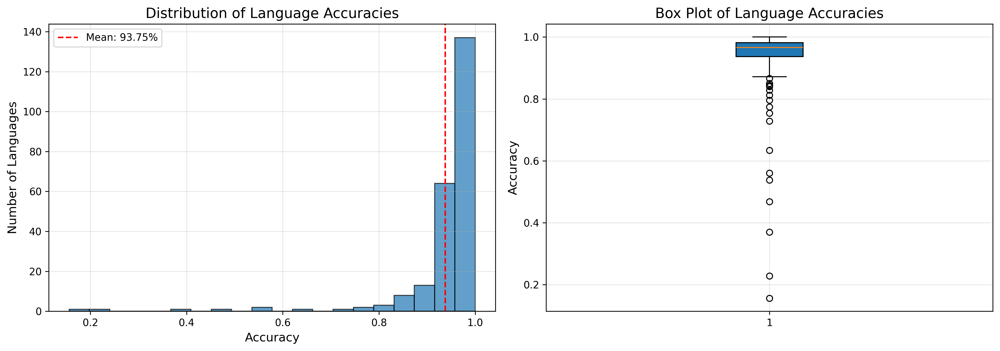

# Language Identification System  

## Project Overview

**A state-of-the-art hybrid language identification system capable of detecting 235 languages with 93.75% overall accuracy. This Deep NLP model combines TF-IDF features with BiLSTM architecture for robust multilingual text and document classification.**

**Hybrid TF-IDF + BiLSTM model** – 235 languages – 93.75% accuracy

<p align="center">
  <br>
  <i>Figure 1: Hybrid TF-IDF + BiLSTM Architecture with Attention Mechanism</i>
</p>

State-of-the-art multilingual language identification system trained on the **WiLI-2018 Dataset** benchmark (235 languages).

## Highlights

- **235 languages** supported  
- Hybrid model: **TF-IDF character n-grams** + **BiLSTM + Attention**  
- **93.75%** overall test accuracy (117,500 samples)  
- Real-time web interface with **Gradio**  
- File support: **.txt**, **.pdf**, **.docx**  
- Confidence visualization & detailed performance reports

## Data Preprocessing Details

# Text Cleaning:
```bash
def clean_text(text):
    # Remove special chars, normalize whitespace
    # Preserve Unicode characters
    # Convert to lowercase
```
# TF-IDF Vectorization:

- Character **n-grams**: 1 to 3 characters

- **3,000** most frequent features

- Sublinear TF scaling

# Sequence Preparation:

- Tokenization with **NLTK**

- Vocabulary: **20,002** most frequent words

- Padding/truncation to 100 tokens


## Architecture Components

# 1. Text Preprocessing Pipeline

Raw Text →      Cleaning   →    Tokenization → TF-IDF/Sequences → Model Input
          │                   │               │                  │
          │    Remove special │ Word tokens   │ Character        │ Padding to
          │    characters     │ with NLTK     │ n-grams (1-3)    │ 100 tokens
          │                   │               │ 3000 features    │

# 2. Neural Network Specifications

¤ TF-IDF Path: 2-layer MLP with BatchNorm and ReLU

¤ Sequence Path:

    ¤Embedding Layer: 128 dimensions

    ¤Bidirectional LSTM: 256 hidden units, 2 layers

    ¤Attention Mechanism: Context weighting

¤ Classifier: 3-layer MLP with dropout (0.3)

# 3. Model Statistics

¤ Total Parameters: 4,214,731

¤ Trainable Parameters: 4,214,731

¤ Input Size: 100 tokens × 128 dimensions

¤ TF-IDF Features: 3,000 character n-grams

¤ Output Classes: 235 languages


## Model Optimization

| Weight Initialization            | Regularization                  | Training Strategy                | 
|----------------------------------|-------------------------------- |----------------------------------|
| Xavier uniform for linear layers | Dropout (0.3) on all layers     | AdamW optimizer                  | 
| Orthogonal for LSTM weights      | Weight decay (1e-5)             | ReduceLROnPlateau scheduler      | 
| Zero for biases                  | Early stopping with patience 15 | Gradient clipping (max_norm=1.0) |          


## Training the Model

```bash
python src/train.py
```
This command will:

- Load and preprocess the WiLI-2018 dataset

- Train the hybrid model with early stopping

- Save model checkpoints and training history

- Generate visualizations and performance reports

- Test with example sentences


## Evaluating Existing Model

```bash
python evaluation_model.py
```

This will:

- Load the pre-trained model from model/ directory

- Evaluate performance on the test set

- Generate detailed performance report

- Test with multilingual example sentences

- Create performance distribution plots


##  Training Details

# Hyperparameters

| Parameter               | Value     | Description                   | 
|-------------------------|-----------|-------------------------------|
| Embedding Dimension     | 128       | Word embedding size           | 
| Hidden Dimension        | 256       | LSTM hidden size              | 
| LSTM Layers             | 2         | Number of BiLSTM layers       | 
| Dropout Rate            | 0.3       | Regularization                | 
| Learning Rate           | 0.0005    | AdamW optimizer               | 
| Batch Size              | 64        | Training batch size           | 
| Max Epochs              | 40        | Maximum training epochs       | 
| Early Stopping Patience | 15        | Epochs without improvement    | 
| TF-IDF Features         | 3000      | Max character n-gram features | 
| Sequence Length         | 100       | Maximum tokens per sample     | 
| Weight Decay            | 1e-5      | L2 regularization             | 


## Model Performance

| Metric              | Value          |
|---------------------|----------------|
| Test Accuracy       | 93.75%         |
| Test Macro F1       | 93.75%         |
| Vocabulary Size     | 20,002         |
| Total Parameters    | ~4.2 M         |
| Inference Time      | < 100 ms       |
| Web Response Time   | < 500 ms       |

### Performance Distribution

| Category       | Accuracy Range | # Languages | Percentage |
|----------------|----------------|-------------|------------|
| Excellent      | ≥ 99%          | 25          | 10.6%      |
| Good           | 95–99%         | 131         | 55.7%      |
| Average        | 80–95%         | 68          | 28.9%      |
| Challenging    | < 80%          | 11          | 4.7%       |

### Top 10 Performing Languages

| Rank | Code | Language            | Accuracy | Samples |
|------|------|---------------------|----------|---------|
| 1    | ckb  | Sorani Kurdish      | 100%     | 500     |
| 2    | kbd  | Kabardian           | 100%     | 500     |
| 3    | min  | Minangkabau         | 100%     | 500     |
| 4    | mlg  | Malagasy            | 100%     | 500     |
| 5    | bod  | Tibetan             | 99.8%    | 500     |
| 6    | ceb  | Cebuano             | 99.8%    | 500     |
| 7    | div  | Dhivehi             | 99.8%    | 500     |
| 8    | jbo  | Lojban              | 99.8%    | 500     |
| 9    | mri  | Maori               | 99.8%    | 500     |
| 10   | nav  | Navajo              | 99.8%    | 500     |

### Most Challenging Languages

| Rank | Code   | Language          | Accuracy | Family   |
|------|--------|-------------------|----------|----------|
| 1    | wuu    | Wu Chinese        | 15.6%    | Asian    |
| 2    | zh-yue | Cantonese         | 22.8%    | Asian    |
| 3    | zho    | Mandarin          | 37.0%    | Asian    |
| 4    | hrv    | Croatian          | 46.8%    | Slavic   |
| 5    | hbs    | Serbo-Croatian    | 53.8%    | Slavic   |


##  Visualizations

# 1. Training History

<p align="center">
  <br>
  <i>Figure 2: Left: Loss curves showing convergence. Right: Accuracy progression over epochs</i>
</p>

# 2. Performance Distribution

<p align="center">
  <br>
  <i>Figure 3: Histogram and box plot showing distribution of language accuracies with mean at 93.75%</i>
</p>

# 3. Web Application for visualisation (Tested in three languages)

## French Test
<p align="center">
  <br>
  <i>Figure 4: Tested in French </i>
</p>

## French Test graph
<p align="center">
  <br>
  <i>Figure 5: Tested in French </i>
</p>


## English Test
<p align="center">
  <br>
  <i>Figure 6: Tested in English </i>
</p>

## English Test graph
<p align="center">
  <br>
  <i>Figure 7: Tested in English </i>
</p>


## German Test
<p align="center">
  <br>
  <i>Figure 8: Tested in German </i>
</p>

## German Test graph
<p align="center">
  <br>
  <i>Figure 9: Tested in German </i>
</p>


## Quick Start

```bash
git clone https://github.com/yourusername/language-identification.git
cd language-identification

# 1. Virtual environment
python -m venv venv
source venv/bin/activate    # Linux / macOS
# or
venv\Scripts\activate       # Windows

# 2. Install dependencies
pip install -r requirements.txt

# 3. Download NLTK data (only once)
python -c "import nltk; nltk.download('punkt'); nltk.download('punkt_tab')"

